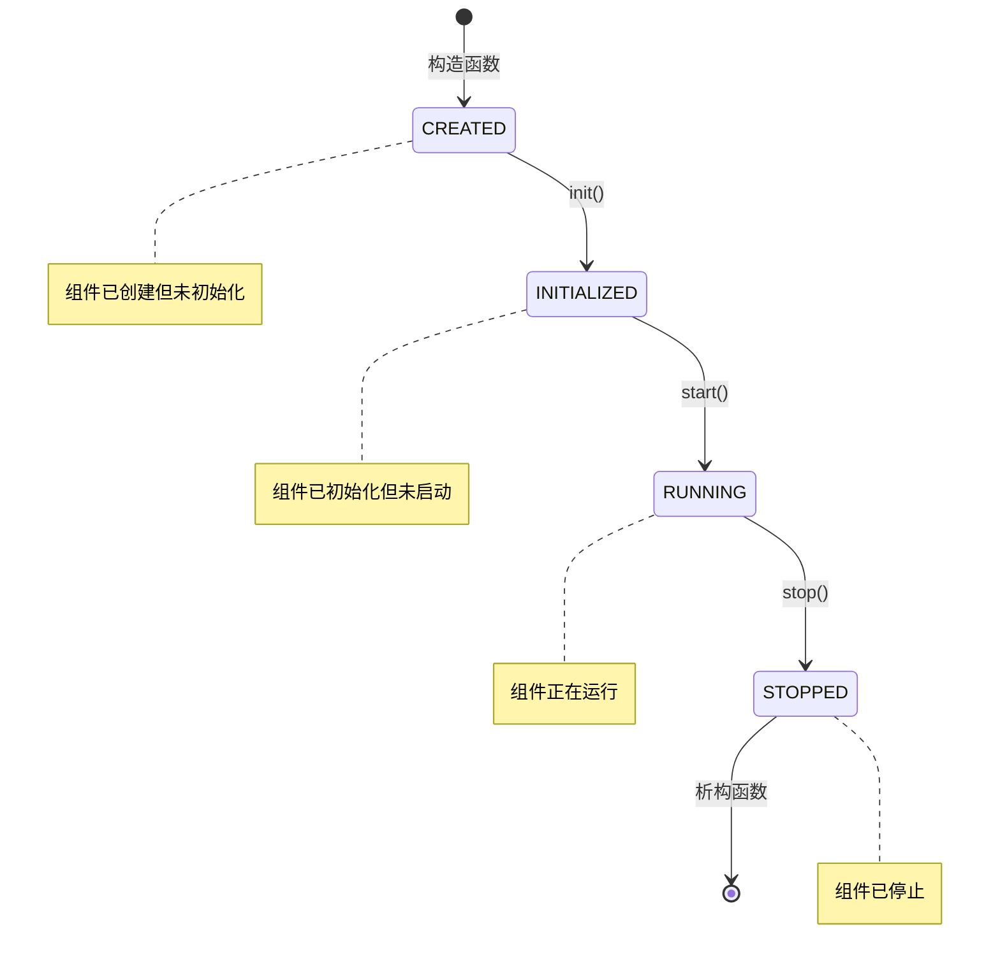

# Core 核心模块 API 文档

核心模块提供 Shield 框架的基础功能，包括组件管理、配置系统、日志系统和命令行解析。

## 📋 模块概览

核心模块包含以下主要类：

- `Component`: 组件基类，提供生命周期管理
- `Config`: 配置管理类，支持 YAML 配置文件
- `Logger`: 日志系统，支持多级别日志输出
- `CommandLineParser`: 命令行参数解析

## 🔧 Component 组件基类

组件基类为所有服务组件提供统一的生命周期管理接口。

### 类定义

```cpp
namespace shield::core {

class Component {
public:
    explicit Component(const std::string& name);
    virtual ~Component() = default;

    // 生命周期方法
    void init();    // 初始化组件
    void start();   // 启动组件
    void stop();    // 停止组件

    // 状态查询
    const std::string& name() const;
    ComponentState state() const;
    bool is_running() const;

protected:
    // 子类需要实现的虚函数
    virtual void on_init() = 0;   // 初始化逻辑
    virtual void on_start() = 0;  // 启动逻辑  
    virtual void on_stop() = 0;   // 停止逻辑

private:
    std::string m_name;
    ComponentState m_state;
};

enum class ComponentState {
    CREATED,    // 已创建
    INITIALIZED,// 已初始化
    RUNNING,    // 运行中
    STOPPED     // 已停止
};

} // namespace shield::core
```

### 使用示例

```cpp
// 自定义组件实现
class MyGameComponent : public shield::core::Component {
public:
    MyGameComponent() : Component("my_game_component") {}

protected:
    void on_init() override {
        SHIELD_LOG_INFO << "初始化游戏组件: " << name();
        // 初始化逻辑...
    }

    void on_start() override {  
        SHIELD_LOG_INFO << "启动游戏组件: " << name();
        // 启动逻辑...
    }

    void on_stop() override {
        SHIELD_LOG_INFO << "停止游戏组件: " << name();
        // 清理逻辑...
    }
};

// 使用组件
int main() {
    auto component = std::make_unique<MyGameComponent>();
    
    component->init();   // 初始化
    component->start();  // 启动
    
    // 运行期间...
    assert(component->is_running());
    
    component->stop();   // 停止
    return 0;
}
```

### 生命周期说明



## ⚙️ Config 配置管理

配置管理类提供 YAML 配置文件的加载、解析和访问功能。

### 类定义

```cpp
namespace shield::core {

class Config {
public:
    // 单例获取
    static Config& instance();
    
    // 配置文件操作
    void load(const std::string& config_file);
    void reload();
    bool is_loaded() const;
    
    // 配置项访问
    template<typename T>
    T get(const std::string& key) const;
    
    template<typename T>
    T get(const std::string& key, const T& default_value) const;
    
    // 配置项设置
    template<typename T>
    void set(const std::string& key, const T& value);
    
    // 配置项查询
    bool has(const std::string& key) const;
    std::vector<std::string> keys() const;
    
    // 配置验证
    bool validate() const;
    std::vector<std::string> get_validation_errors() const;

private:
    Config() = default;
    YAML::Node m_config;
    std::string m_config_file;
    mutable std::shared_mutex m_mutex;
};

} // namespace shield::core
```

### 使用示例

```cpp
// 加载配置文件
auto& config = shield::core::Config::instance();
config.load("config/shield.yaml");

// 获取配置项
auto host = config.get<std::string>("gateway.listener.host");
auto port = config.get<uint16_t>("gateway.listener.port");
auto threads = config.get<int>("gateway.threading.io_threads", 4); // 带默认值

// 获取复杂配置
auto components = config.get<std::vector<std::string>>("components");
for (const auto& comp : components) {
    SHIELD_LOG_INFO << "启用组件: " << comp;
}

// 检查配置项存在
if (config.has("database.enabled")) {
    bool db_enabled = config.get<bool>("database.enabled");
    if (db_enabled) {
        auto db_host = config.get<std::string>("database.host");
        // 初始化数据库...
    }
}

// 设置运行时配置
config.set("runtime.start_time", std::time(nullptr));
config.set("runtime.node_id", generate_node_id());
```

### 支持的数据类型

| C++ 类型 | YAML 示例 | 说明 |
|----------|-----------|------|
| `bool` | `true`, `false` | 布尔值 |
| `int`, `int32_t` | `42`, `-100` | 32位整数 |
| `int64_t` | `1234567890` | 64位整数 |
| `uint16_t`, `uint32_t` | `8080`, `65535` | 无符号整数 |
| `float`, `double` | `3.14`, `2.718` | 浮点数 |
| `std::string` | `"hello"`, `world` | 字符串 |
| `std::vector<T>` | `[1, 2, 3]` | 数组 |
| `std::map<string, T>` | `{key: value}` | 字典 |

## 📝 Logger 日志系统

日志系统提供多级别、多输出目标的日志功能。

### 类定义

```cpp
namespace shield::core {

enum class LogLevel {
    DEBUG = 0,
    INFO = 1, 
    WARN = 2,
    ERROR = 3
};

struct LogConfig {
    LogLevel level = LogLevel::INFO;
    bool console_output = true;
    bool file_output = false;
    std::string file_path = "logs/shield.log";
    size_t max_file_size = 10 * 1024 * 1024; // 10MB
    size_t max_files = 5;
};

class Logger {
public:
    // 初始化日志系统
    static void init(const LogConfig& config);
    
    // 日志级别转换
    static LogLevel level_from_string(const std::string& level_str);
    static std::string level_to_string(LogLevel level);
    
    // 日志输出方法
    static void log(LogLevel level, const std::string& message);
    static void debug(const std::string& message);
    static void info(const std::string& message);
    static void warn(const std::string& message); 
    static void error(const std::string& message);
    
    // 格式化日志
    template<typename... Args>
    static void log_formatted(LogLevel level, const std::string& format, Args&&... args);

private:
    static std::unique_ptr<LoggerImpl> s_impl;
};

} // namespace shield::core
```

### 日志宏定义

```cpp
// 便捷的日志宏
#define SHIELD_LOG_DEBUG BOOST_LOG_TRIVIAL(debug)
#define SHIELD_LOG_INFO  BOOST_LOG_TRIVIAL(info)
#define SHIELD_LOG_WARN  BOOST_LOG_TRIVIAL(warning)
#define SHIELD_LOG_ERROR BOOST_LOG_TRIVIAL(error)

// 带条件的日志宏
#define SHIELD_LOG_DEBUG_IF(condition) \
    if (condition) SHIELD_LOG_DEBUG

#define SHIELD_LOG_INFO_IF(condition) \
    if (condition) SHIELD_LOG_INFO
```

### 使用示例

```cpp
// 初始化日志系统
shield::core::LogConfig log_config;
log_config.level = shield::core::LogLevel::DEBUG;
log_config.console_output = true;
log_config.file_output = true;
log_config.file_path = "logs/game_server.log";
shield::core::Logger::init(log_config);

// 使用日志宏 (推荐)
SHIELD_LOG_INFO << "服务器启动中...";
SHIELD_LOG_DEBUG << "加载配置文件: " << config_file;
SHIELD_LOG_WARN << "连接数接近上限: " << connection_count;
SHIELD_LOG_ERROR << "数据库连接失败: " << error_msg;

// 使用静态方法
shield::core::Logger::info("服务器启动完成");
shield::core::Logger::error("严重错误: " + error_description);

// 条件日志
SHIELD_LOG_DEBUG_IF(debug_mode) << "调试信息: " << debug_data;

// 格式化日志
shield::core::Logger::log_formatted(
    shield::core::LogLevel::INFO,
    "玩家 {} 在房间 {} 中得分 {}",
    player_name, room_id, score
);
```

### 日志格式

默认日志格式：
```
[2024-01-20 15:30:45.123456] [info] 服务器启动完成
[2024-01-20 15:30:45.125789] [debug] 加载配置文件: config/shield.yaml  
[2024-01-20 15:30:45.128012] [warn] 连接数接近上限: 9500
[2024-01-20 15:30:45.130345] [error] 数据库连接失败: Connection timeout
```

可通过配置自定义格式：
```yaml
logger:
  format: "[%TimeStamp%] [%Severity%] [%ThreadID%] %Message%"
  time_format: "%Y-%m-%d %H:%M:%S.%f"
```

## 🔧 CommandLineParser 命令行解析

命令行解析器处理程序启动时的参数和选项。

### 类定义

```cpp
namespace shield::core {

struct CommandLineOptions {
    bool show_help = false;
    bool show_version = false;
    std::string config_file;
    std::string log_level;
    bool validate_config = false;
    bool dump_config = false;
    bool test_mode = false;
};

class CommandLineParser {
public:
    // 解析命令行参数
    static CommandLineOptions parse(int argc, char* argv[]);
    
    // 显示帮助信息
    static void print_help();
    
    // 显示版本信息
    static void print_version();

private:
    static boost::program_options::options_description create_options();
};

} // namespace shield::core
```

### 使用示例

```cpp
int main(int argc, char* argv[]) {
    // 解析命令行参数
    auto options = shield::core::CommandLineParser::parse(argc, argv);
    
    // 处理帮助和版本
    if (options.show_help) {
        shield::core::CommandLineParser::print_help();
        return 0;
    }
    
    if (options.show_version) {
        shield::core::CommandLineParser::print_version();
        return 0;
    }
    
    // 加载配置文件
    auto& config = shield::core::Config::instance();
    std::string config_file = options.config_file.empty() ? 
        "config/shield.yaml" : options.config_file;
    config.load(config_file);
    
    // 配置验证模式
    if (options.validate_config) {
        if (config.validate()) {
            std::cout << "配置文件验证通过" << std::endl;
            return 0;
        } else {
            std::cerr << "配置文件验证失败" << std::endl;
            auto errors = config.get_validation_errors();
            for (const auto& error : errors) {
                std::cerr << "  - " << error << std::endl;
            }
            return 1;
        }
    }
    
    // 配置转储模式
    if (options.dump_config) {
        // 输出解析后的配置...
        return 0;
    }
    
    // 设置日志级别
    if (!options.log_level.empty()) {
        shield::core::LogConfig log_config;
        log_config.level = shield::core::Logger::level_from_string(options.log_level);
        shield::core::Logger::init(log_config);
    }
    
    // 继续程序启动...
    return 0;
}
```

### 支持的命令行选项

```bash
# 显示帮助
./shield --help
./shield -h

# 显示版本
./shield --version  
./shield -v

# 指定配置文件
./shield --config /path/to/config.yaml
./shield -c /path/to/config.yaml

# 设置日志级别
./shield --log-level debug
./shield --log-level info

# 验证配置文件
./shield --validate-config

# 转储配置 (调试用)
./shield --dump-config

# 测试模式
./shield --test

# 组合使用
./shield -c prod.yaml --log-level warn --validate-config
```

## 🧪 测试示例

### 单元测试

```cpp
#define BOOST_TEST_MODULE CoreTest
#include <boost/test/unit_test.hpp>
#include "shield/core/config.hpp"
#include "shield/core/logger.hpp"

BOOST_AUTO_TEST_SUITE(ConfigTest)

BOOST_AUTO_TEST_CASE(test_config_loading) {
    // 创建临时配置文件
    std::string config_content = R"(
test:
  string_value: "hello"
  int_value: 42
  bool_value: true
  array_value: [1, 2, 3]
)";
    
    std::string temp_file = "test_config.yaml";
    std::ofstream file(temp_file);
    file << config_content;
    file.close();
    
    // 加载配置
    auto& config = shield::core::Config::instance();
    config.load(temp_file);
    
    // 测试配置访问
    BOOST_CHECK_EQUAL(config.get<std::string>("test.string_value"), "hello");
    BOOST_CHECK_EQUAL(config.get<int>("test.int_value"), 42);
    BOOST_CHECK_EQUAL(config.get<bool>("test.bool_value"), true);
    
    auto array = config.get<std::vector<int>>("test.array_value");
    BOOST_CHECK_EQUAL(array.size(), 3);
    BOOST_CHECK_EQUAL(array[0], 1);
    
    // 清理
    std::remove(temp_file.c_str());
}

BOOST_AUTO_TEST_CASE(test_config_default_values) {
    auto& config = shield::core::Config::instance();
    
    // 测试不存在的键的默认值
    BOOST_CHECK_EQUAL(config.get<int>("nonexistent.key", 100), 100);
    BOOST_CHECK_EQUAL(config.get<std::string>("nonexistent.key", "default"), "default");
}

BOOST_AUTO_TEST_SUITE_END()

BOOST_AUTO_TEST_SUITE(LoggerTest)

BOOST_AUTO_TEST_CASE(test_logger_levels) {
    // 测试日志级别转换
    BOOST_CHECK_EQUAL(shield::core::Logger::level_from_string("debug"), 
                      shield::core::LogLevel::DEBUG);
    BOOST_CHECK_EQUAL(shield::core::Logger::level_from_string("info"), 
                      shield::core::LogLevel::INFO);
    BOOST_CHECK_EQUAL(shield::core::Logger::level_from_string("warn"), 
                      shield::core::LogLevel::WARN);
    BOOST_CHECK_EQUAL(shield::core::Logger::level_from_string("error"), 
                      shield::core::LogLevel::ERROR);
}

BOOST_AUTO_TEST_SUITE_END()
```

### 集成测试

```cpp
BOOST_AUTO_TEST_SUITE(CoreIntegrationTest)

BOOST_AUTO_TEST_CASE(test_component_lifecycle) {
    class TestComponent : public shield::core::Component {
    public:
        TestComponent() : Component("test_component") {}
        
        bool init_called = false;
        bool start_called = false;
        bool stop_called = false;
        
    protected:
        void on_init() override { init_called = true; }
        void on_start() override { start_called = true; }
        void on_stop() override { stop_called = true; }
    };
    
    auto component = std::make_unique<TestComponent>();
    
    // 测试初始状态
    BOOST_CHECK_EQUAL(component->state(), shield::core::ComponentState::CREATED);
    BOOST_CHECK(!component->is_running());
    
    // 测试初始化
    component->init();
    BOOST_CHECK(component->init_called);
    BOOST_CHECK_EQUAL(component->state(), shield::core::ComponentState::INITIALIZED);
    
    // 测试启动
    component->start();
    BOOST_CHECK(component->start_called);
    BOOST_CHECK_EQUAL(component->state(), shield::core::ComponentState::RUNNING);
    BOOST_CHECK(component->is_running());
    
    // 测试停止
    component->stop();
    BOOST_CHECK(component->stop_called);
    BOOST_CHECK_EQUAL(component->state(), shield::core::ComponentState::STOPPED);
    BOOST_CHECK(!component->is_running());
}

BOOST_AUTO_TEST_SUITE_END()
```

## 📚 最佳实践

### 1. 组件设计

```cpp
// ✅ 好的组件设计
class GoodComponent : public shield::core::Component {
public:
    GoodComponent() : Component("good_component") {}

protected:
    void on_init() override {
        // 只做初始化，不启动服务
        load_configuration();
        setup_internal_state();
    }

    void on_start() override {
        // 启动服务和线程
        start_worker_threads();
        register_signal_handlers();
    }

    void on_stop() override {
        // 优雅停止，先停服务再清理
        stop_worker_threads();
        cleanup_resources();
    }
};

// ❌ 不好的组件设计
class BadComponent : public shield::core::Component {
protected:
    void on_init() override {
        // 不要在初始化中启动服务！
        start_network_service(); // 错误！
    }

    void on_start() override {
        // 不要在启动中做初始化！
        load_configuration(); // 错误！
    }
};
```

### 2. 配置管理

```cpp
// ✅ 好的配置使用
class ConfigurableService {
private:
    void load_settings() {
        auto& config = shield::core::Config::instance();
        
        // 使用默认值
        m_timeout = config.get<int>("service.timeout", 5000);
        m_max_connections = config.get<int>("service.max_connections", 1000);
        
        // 验证配置值
        if (m_timeout <= 0) {
            throw std::invalid_argument("timeout must be positive");
        }
        
        // 缓存常用配置
        m_debug_enabled = config.get<bool>("debug.enabled", false);
    }
};

// ❌ 不好的配置使用
class BadConfigUsage {
private:
    void bad_practice() {
        auto& config = shield::core::Config::instance();
        
        // 不要每次都查询配置
        for (int i = 0; i < 1000; ++i) {
            if (config.get<bool>("debug.enabled")) { // 性能问题！
                // ...
            }
        }
        
        // 不要忽略异常
        auto value = config.get<int>("missing.key"); // 可能抛异常！
    }
};
```

### 3. 日志使用

```cpp
// ✅ 好的日志实践
void good_logging_practice() {
    // 使用合适的日志级别
    SHIELD_LOG_DEBUG << "详细的调试信息: " << debug_data;
    SHIELD_LOG_INFO << "一般信息: 服务启动完成";
    SHIELD_LOG_WARN << "警告: 连接数过高 " << connection_count;
    SHIELD_LOG_ERROR << "错误: 数据库连接失败 " << error_code;
    
    // 避免在日志中泄露敏感信息
    SHIELD_LOG_INFO << "用户登录: " << mask_sensitive_data(username);
    
    // 使用条件日志避免性能影响
    SHIELD_LOG_DEBUG_IF(debug_mode) << "昂贵的调试计算: " << expensive_debug_info();
}

// ❌ 不好的日志实践
void bad_logging_practice() {
    // 级别使用错误
    SHIELD_LOG_ERROR << "用户点击了按钮"; // 应该用 DEBUG 或 INFO
    SHIELD_LOG_DEBUG << "系统崩溃！"; // 应该用 ERROR
    
    // 泄露敏感信息
    SHIELD_LOG_INFO << "用户密码: " << password; // 危险！
    
    // 性能问题
    SHIELD_LOG_DEBUG << "复杂计算结果: " << very_expensive_calculation(); // 即使 DEBUG 关闭也会计算
}
```

---

核心模块是 Shield 框架的基础，提供了稳定可靠的基础功能。正确使用这些 API 可以让您的游戏服务器更加健壮和易于维护。