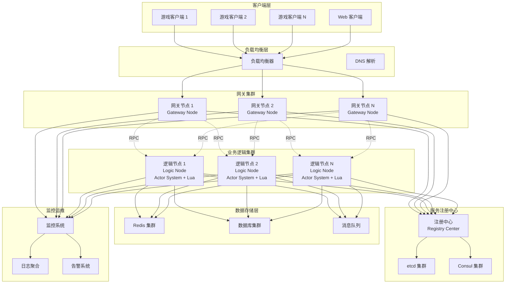
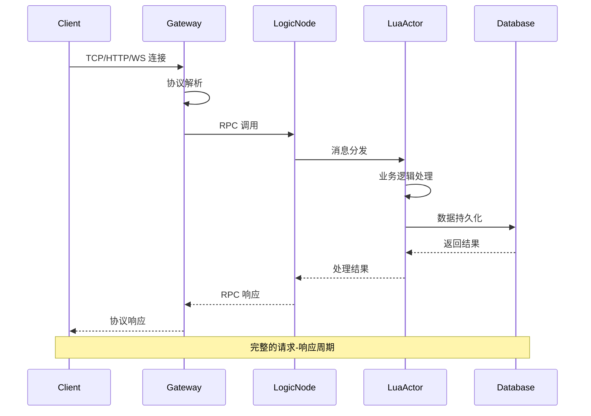

# Shield 架构设计

本文档详细介绍 Shield 游戏服务器框架的架构设计，包括整体架构、核心组件、与其他框架的对比分析，以及完整的架构图。

## 🏗️ 整体架构

Shield 采用**分层微服务架构**，结合了 Pitaya 的分布式理念和 Skynet 的高性能并发模型，形成了独特的混合架构。

### 架构核心理念

1. **分布式优先**: 天然支持水平扩展的微服务架构
2. **Actor 模型**: 基于消息传递的并发编程模型
3. **语言分层**: C++ 负责系统层，Lua 负责业务逻辑层
4. **协议无关**: 支持多种网络协议的统一处理
5. **插件化设计**: 核心组件可插拔，易于扩展

## 📊 架构层次图

```mermaid
graph TD
    subgraph 应用层 (Lua)
        A1[游戏逻辑]
        A2[业务规则]
        A3[Lua Actor 脚本]
        A4[状态管理]
        A5[事件处理]
        A6[player_actor.lua]
    end

    subgraph 业务逻辑层 (C++)
        B1[Actor 系统]
        B2[Lua 集成]
        B3[消息路由]
        B4[生命周期]
        B5[VM 池管理]
        B6[序列化/反序列化]
    end

    subgraph 服务层 (C++)
        C1[网关服务]
        C2[逻辑服务]
        C3[注册中心]
        C4[协议处理]
        C5[分布式Actor]
        C6[服务发现]
    end

    subgraph 网络层 (C++)
        D1[Reactor 池]
        D2[连接管理]
        D3[协议适配器]
        D4[I/O 多路复用]
        D5[会话管理]
        D6[TCP/HTTP/WebSocket]
    end

    subgraph 基础设施层 (C++)
        E1[配置管理]
        E2[日志系统]
        E3[监控和指标]
        E4[内存管理]
        E5[错误处理]
        E6[性能分析]
    end

    A1 --> B1
    A2 --> B2
    A3 --> B3
    B1 --> C1
    B2 --> C2
    B3 --> C3
    C1 --> D1
    C2 --> D2
    C3 --> D3
    D1 --> E1
    D2 --> E2
    D3 --> E3
```

## 🌐 分布式架构图



## 🔧 核心组件详解

### 1. 网关节点 (Gateway Node)

**职责**: 客户端接入、协议转换、消息路由

```cpp
class GatewayComponent : public core::Component {
private:
    // 网络层组件
    std::unique_ptr<net::MasterReactor> m_master_reactor;    // 主 Reactor
    std::unique_ptr<net::MasterReactor> m_http_reactor;      // HTTP 服务
    std::unique_ptr<net::MasterReactor> m_ws_reactor;        // WebSocket 服务
    
    // 协议处理器
    std::unique_ptr<protocol::HttpProtocolHandler> m_http_handler;
    std::unique_ptr<protocol::WebSocketProtocolHandler> m_websocket_handler;
    
    // 会话管理
    std::unordered_map<uint64_t, std::weak_ptr<net::Session>> m_sessions;
    std::unordered_map<uint64_t, caf::actor> m_session_actors;
    
    // 分布式系统
    actor::DistributedActorSystem& m_actor_system;
    script::LuaVMPool& m_lua_vm_pool;
};
```

**关键特性**:
- 支持 TCP/HTTP/WebSocket 多协议
- Main-Sub Reactor 网络架构
- 会话生命周期管理
- 消息路由和负载均衡
- 协议无关的统一接口

### 2. 逻辑节点 (Logic Node)

**职责**: 业务逻辑处理、Actor 管理、Lua 脚本执行

```cpp
class DistributedActorSystem {
private:
    caf::actor_system& m_system;                    // CAF Actor 系统
    std::shared_ptr<IServiceDiscovery> m_discovery; // 服务发现
    std::unique_ptr<ActorRegistry> m_registry;      // Actor 注册表
    DistributedActorConfig m_config;                // 配置信息
    
public:
    // Actor 创建和管理
    caf::actor create_actor(const std::string& script_path);
    void register_actor(const std::string& name, caf::actor actor);
    caf::actor find_actor(const std::string& name);
};
```

**核心机制**:
- CAF 分布式 Actor 系统
- Lua VM 池化管理
- 消息驱动的异步处理
- 跨节点 RPC 通信
- 热重载脚本支持

### 3. Lua 集成层

**职责**: Lua 虚拟机管理、C++/Lua 绑定、脚本生命周期

```cpp
class LuaVMPool : public core::Component {
private:
    std::queue<std::unique_ptr<LuaEngine>> m_available_vms;  // 可用 VM 队列
    std::unordered_set<std::unique_ptr<LuaEngine>> m_in_use_vms; // 使用中 VM
    std::mutex m_pool_mutex;
    std::condition_variable m_cv;
    LuaVMPoolConfig m_config;
    
public:
    VMHandle acquire_vm();           // 获取 VM
    void release_vm(VMHandle handle); // 释放 VM
    void reload_script(const std::string& script_path); // 热重载
};
```

**Lua Actor 示例**:
```lua
-- scripts/player_actor.lua
local player_state = {
    player_id = "",
    level = 1,
    experience = 0,
    gold = 1000
}

function on_message(msg)
    if msg.type == "get_info" then
        return handle_get_info(msg)
    elseif msg.type == "level_up" then
        return handle_level_up(msg)
    end
end

function handle_get_info(msg)
    return create_response(true, {
        player_id = player_state.player_id,
        level = tostring(player_state.level),
        experience = tostring(player_state.experience),
        gold = tostring(player_state.gold)
    })
end
```

### 4. 网络层架构

**Main-Sub Reactor 模式**:

```cpp
class MasterReactor {
private:
    boost::asio::io_context m_io_context;           // I/O 上下文
    boost::asio::ip::tcp::acceptor m_acceptor;      // 连接接受器
    std::vector<std::unique_ptr<SlaveReactor>> m_slaves; // 从 Reactor 池
    
public:
    void start();  // 启动主 Reactor
    void add_slave(std::unique_ptr<SlaveReactor> slave);
    std::shared_ptr<Session> create_session(tcp::socket socket);
};

class SlaveReactor {
private:
    boost::asio::io_context m_io_context;
    std::thread m_worker_thread;
    
public:
    void run();    // 在独立线程中运行
    void handle_session(std::shared_ptr<Session> session);
};
```

**连接处理流程**:
1. MasterReactor 接受连接
2. 创建 Session 对象
3. 分发给 SlaveReactor 处理
4. 异步 I/O 处理数据
5. 协议解析和消息路由

### 5. 服务发现系统

**多后端支持架构**:

```cpp
class IServiceDiscovery {
public:
    virtual void register_service(const ServiceInstance& instance) = 0;
    virtual void unregister_service(const std::string& service_id) = 0;
    virtual std::vector<ServiceInstance> discover_services(const std::string& service_name) = 0;
    virtual void start_heartbeat(const std::string& service_id) = 0;
};

// 具体实现
class EtcdDiscovery : public IServiceDiscovery { /* etcd 实现 */ };
class ConsulDiscovery : public IServiceDiscovery { /* consul 实现 */ };
class RedisDiscovery : public IServiceDiscovery { /* redis 实现 */ };
class LocalDiscovery : public IServiceDiscovery { /* 内存实现 */ };
```


## 📈 性能特性

### 并发性能

```
┌─────────────────────────────────────────────────────────┐
│                     并发连接处理能力                      │
├─────────────────────────────────────────────────────────┤
│  单网关节点: 50,000+ 并发连接                            │
│  单逻辑节点: 10,000+ Actor 实例                         │
│  集群总计:   1,000,000+ 并发用户                        │
└─────────────────────────────────────────────────────────┘

┌─────────────────────────────────────────────────────────┐
│                     消息处理性能                        │
├─────────────────────────────────────────────────────────┤
│  网关节点:   100,000+ 消息/秒                           │
│  逻辑节点:   50,000+ 消息/秒/核心                       │
│  平均延迟:   < 5ms (局域网)                             │
│  P99 延迟:   < 20ms                                    │
└─────────────────────────────────────────────────────────┘
```

### 内存使用

```
┌─────────────────────────────────────────────────────────┐
│                     内存使用统计                        │
├─────────────────────────────────────────────────────────┤
│  基础框架:     ~100MB                                   │
│  每个连接:     ~4KB                                     │
│  每个 Actor:   ~8KB                                     │
│  Lua VM:       ~2MB (池化复用)                          │
└─────────────────────────────────────────────────────────┘
```

## 🔄 消息流转图



## 🛡️ 容错和高可用

### 故障恢复机制

1. **网关层故障**: 负载均衡器自动切换
2. **逻辑节点故障**: Actor 迁移到其他节点
3. **注册中心故障**: 多副本保证服务发现
4. **网络分区**: 优雅降级和自动恢复

### 监控和告警

```yaml
# 监控指标
metrics:
  - connection_count      # 连接数
  - message_rate         # 消息速率
  - actor_count          # Actor 数量
  - memory_usage         # 内存使用
  - cpu_usage           # CPU 使用率
  - network_io          # 网络 I/O

# 告警规则
alerts:
  - high_memory_usage: >80%
  - high_cpu_usage: >90%
  - connection_spike: >threshold
  - message_queue_backlog: >1000
```

## 🚀 扩展性设计

### 水平扩展策略

1. **无状态网关**: 可任意添加网关节点
2. **有状态逻辑**: 基于一致性哈希的 Actor 分片
3. **数据分区**: 按业务逻辑进行数据分片
4. **缓存层**: Redis 集群提供分布式缓存

### 插件化架构

```cpp
// 协议插件接口
class IProtocolPlugin {
public:
    virtual void handle_message(const Message& msg) = 0;
    virtual std::string get_protocol_name() const = 0;
};

// 序列化插件接口
class ISerializerPlugin {
public:
    virtual std::string serialize(const Object& obj) = 0;
    virtual Object deserialize(const std::string& data) = 0;
};

// 服务发现插件接口
class IDiscoveryPlugin {
public:
    virtual void register_service(const ServiceInfo& info) = 0;
    virtual std::vector<ServiceInfo> discover_services(const std::string& name) = 0;
};
```

---

## 📋 总结

Shield 架构设计的核心优势：

1. **高性能**: C++ 底层 + Lua 业务层的最佳组合
2. **高可用**: 分布式架构 + 故障自动恢复
3. **高扩展**: 微服务架构 + 插件化设计
4. **开发友好**: 热重载 + 丰富的开发工具
5. **生产就绪**: 完整的监控 + 运维支持

这种架构特别适合：
- **大型 MMO 游戏**: 需要支持大量并发用户
- **实时竞技游戏**: 对延迟和性能要求极高
- **社交游戏**: 需要复杂的业务逻辑和频繁更新
- **企业级应用**: 对稳定性和可维护性要求高

通过合理的架构设计和技术选型，Shield 在性能、可扩展性和开发效率之间找到了最佳平衡点。