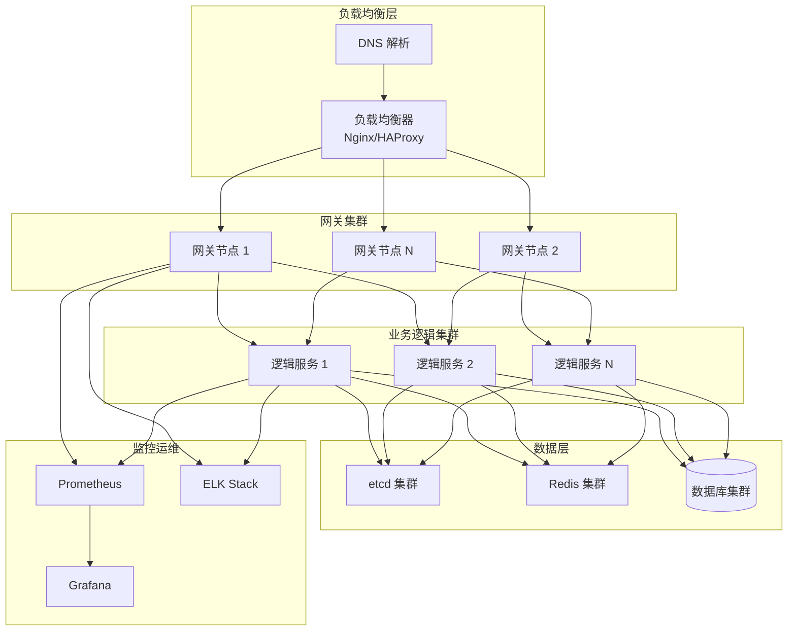

# 生产部署

本文档介绍如何将 Shield 游戏服务器框架部署到生产环境。

## 🏗️ 部署架构

### 推荐的生产架构



## 🐳 Docker 部署

### 1. 构建 Docker 镜像

创建 `Dockerfile`:

```dockerfile
# 多阶段构建
FROM ubuntu:22.04 AS builder

# 安装构建依赖
RUN apt-get update && apt-get install -y \
    build-essential \
    cmake \
    git \
    curl \
    zip \
    unzip \
    tar \
    pkg-config \
    && rm -rf /var/lib/apt/lists/*

# 安装 vcpkg
WORKDIR /opt
RUN git clone https://github.com/Microsoft/vcpkg.git && \
    cd vcpkg && \
    ./bootstrap-vcpkg.sh

ENV VCPKG_ROOT=/opt/vcpkg

# 复制源码
WORKDIR /app
COPY . .

# 构建项目
RUN cmake -B build -S . \
    -DCMAKE_TOOLCHAIN_FILE=$VCPKG_ROOT/scripts/buildsystems/vcpkg.cmake \
    -DCMAKE_BUILD_TYPE=Release && \
    cmake --build build --parallel $(nproc)

# 运行时镜像
FROM ubuntu:22.04

# 安装运行时依赖
RUN apt-get update && apt-get install -y \
    libssl3 \
    libcurl4 \
    && rm -rf /var/lib/apt/lists/*

# 创建应用用户
RUN useradd -r -s /bin/false shield

# 复制二进制文件和配置
COPY --from=builder /app/bin/shield /usr/local/bin/
COPY --from=builder /app/config /etc/shield/
COPY --from=builder /app/scripts /usr/local/share/shield/scripts/

# 创建必要目录
RUN mkdir -p /var/log/shield /var/lib/shield && \
    chown -R shield:shield /var/log/shield /var/lib/shield

# 设置用户和工作目录
USER shield
WORKDIR /var/lib/shield

# 健康检查
HEALTHCHECK --interval=30s --timeout=10s --start-period=5s --retries=3 \
    CMD curl -f http://localhost:8081/health || exit 1

# 暴露端口
EXPOSE 8080 8081 8082

# 启动命令
CMD ["shield", "--config", "/etc/shield/shield.yaml"]
```

### 2. Docker Compose 配置

创建 `docker-compose.yml`:

```yaml
version: '3.8'

services:
  # etcd 服务发现
  etcd:
    image: quay.io/coreos/etcd:v3.5.7
    command: >
      etcd
      --name=etcd0
      --data-dir=/etcd-data
      --listen-client-urls=http://0.0.0.0:2379
      --advertise-client-urls=http://etcd:2379
      --listen-peer-urls=http://0.0.0.0:2380
      --initial-advertise-peer-urls=http://etcd:2380
      --initial-cluster=etcd0=http://etcd:2380
      --initial-cluster-token=etcd-cluster
      --initial-cluster-state=new
    volumes:
      - etcd_data:/etcd-data
    ports:
      - "2379:2379"
    
  # Redis 缓存
  redis:
    image: redis:7-alpine
    command: redis-server --appendonly yes
    volumes:
      - redis_data:/data
    ports:
      - "6379:6379"
    
  # PostgreSQL 数据库
  postgres:
    image: postgres:15-alpine
    environment:
      POSTGRES_DB: shield
      POSTGRES_USER: shield
      POSTGRES_PASSWORD: shield_password
    volumes:
      - postgres_data:/var/lib/postgresql/data
      - ./sql/init.sql:/docker-entrypoint-initdb.d/init.sql
    ports:
      - "5432:5432"
    
  # Shield 网关节点
  shield-gateway-1:
    build: .
    depends_on:
      - etcd
      - redis
      - postgres
    environment:
      - SHIELD_NODE_TYPE=gateway
      - SHIELD_NODE_ID=gateway-1
      - SHIELD_ETCD_ENDPOINTS=http://etcd:2379
      - SHIELD_REDIS_HOST=redis
      - SHIELD_DB_HOST=postgres
    ports:
      - "8080:8080"  # TCP
      - "8081:8081"  # HTTP
      - "8082:8082"  # WebSocket
    volumes:
      - ./config/production.yaml:/etc/shield/shield.yaml
      - ./scripts:/usr/local/share/shield/scripts
      - shield_logs_1:/var/log/shield
    restart: unless-stopped
    
  shield-gateway-2:
    build: .
    depends_on:
      - etcd
      - redis
      - postgres
    environment:
      - SHIELD_NODE_TYPE=gateway
      - SHIELD_NODE_ID=gateway-2
      - SHIELD_ETCD_ENDPOINTS=http://etcd:2379
      - SHIELD_REDIS_HOST=redis
      - SHIELD_DB_HOST=postgres
    ports:
      - "8180:8080"
      - "8181:8081"
      - "8182:8082"
    volumes:
      - ./config/production.yaml:/etc/shield/shield.yaml
      - ./scripts:/usr/local/share/shield/scripts
      - shield_logs_2:/var/log/shield
    restart: unless-stopped
    
  # Shield 逻辑节点
  shield-logic-1:
    build: .
    depends_on:
      - etcd
      - redis
      - postgres
    environment:
      - SHIELD_NODE_TYPE=logic
      - SHIELD_NODE_ID=logic-1
      - SHIELD_ETCD_ENDPOINTS=http://etcd:2379
      - SHIELD_REDIS_HOST=redis
      - SHIELD_DB_HOST=postgres
    volumes:
      - ./config/production.yaml:/etc/shield/shield.yaml
      - ./scripts:/usr/local/share/shield/scripts
      - shield_logic_logs_1:/var/log/shield
    restart: unless-stopped
    
  # Nginx 负载均衡器
  nginx:
    image: nginx:alpine
    depends_on:
      - shield-gateway-1
      - shield-gateway-2
    ports:
      - "80:80"
      - "443:443"
    volumes:
      - ./nginx/nginx.conf:/etc/nginx/nginx.conf
      - ./nginx/ssl:/etc/nginx/ssl
    restart: unless-stopped
    
  # Prometheus 监控
  prometheus:
    image: prom/prometheus:latest
    ports:
      - "9090:9090"
    volumes:
      - ./monitoring/prometheus.yml:/etc/prometheus/prometheus.yml
      - prometheus_data:/prometheus
    command:
      - '--config.file=/etc/prometheus/prometheus.yml'
      - '--storage.tsdb.path=/prometheus'
      - '--web.console.libraries=/etc/prometheus/console_libraries'
      - '--web.console.templates=/etc/prometheus/consoles'
      - '--web.enable-lifecycle'
    
  # Grafana 仪表板
  grafana:
    image: grafana/grafana:latest
    depends_on:
      - prometheus
    ports:
      - "3000:3000"
    environment:
      - GF_SECURITY_ADMIN_PASSWORD=admin123
    volumes:
      - grafana_data:/var/lib/grafana
      - ./monitoring/grafana/dashboards:/var/lib/grafana/dashboards
      - ./monitoring/grafana/provisioning:/etc/grafana/provisioning

volumes:
  etcd_data:
  redis_data:
  postgres_data:
  shield_logs_1:
  shield_logs_2:
  shield_logic_logs_1:
  prometheus_data:
  grafana_data:
```

### 3. Nginx 负载均衡配置

创建 `nginx/nginx.conf`:

```nginx
events {
    worker_connections 1024;
}

http {
    upstream shield_gateway {
        least_conn;
        server shield-gateway-1:8081 max_fails=3 fail_timeout=30s;
        server shield-gateway-2:8181 max_fails=3 fail_timeout=30s;
    }
    
    upstream shield_websocket {
        ip_hash;  # WebSocket 需要会话保持
        server shield-gateway-1:8082 max_fails=3 fail_timeout=30s;
        server shield-gateway-2:8182 max_fails=3 fail_timeout=30s;
    }
    
    # HTTP API 负载均衡
    server {
        listen 80;
        server_name api.yourgame.com;
        
        location /health {
            access_log off;
            return 200 "healthy\n";
            add_header Content-Type text/plain;
        }
        
        location / {
            proxy_pass http://shield_gateway;
            proxy_set_header Host $host;
            proxy_set_header X-Real-IP $remote_addr;
            proxy_set_header X-Forwarded-For $proxy_add_x_forwarded_for;
            proxy_set_header X-Forwarded-Proto $scheme;
            
            # 超时设置
            proxy_connect_timeout 5s;
            proxy_send_timeout 60s;
            proxy_read_timeout 60s;
        }
    }
    
    # WebSocket 负载均衡
    server {
        listen 80;
        server_name ws.yourgame.com;
        
        location / {
            proxy_pass http://shield_websocket;
            proxy_http_version 1.1;
            proxy_set_header Upgrade $http_upgrade;
            proxy_set_header Connection "upgrade";
            proxy_set_header Host $host;
            proxy_set_header X-Real-IP $remote_addr;
            proxy_set_header X-Forwarded-For $proxy_add_x_forwarded_for;
            proxy_set_header X-Forwarded-Proto $scheme;
            
            # WebSocket 特殊设置
            proxy_read_timeout 3600s;
            proxy_send_timeout 3600s;
        }
    }
}

# TCP 负载均衡 (需要 stream 模块)
stream {
    upstream shield_tcp {
        least_conn;
        server shield-gateway-1:8080 max_fails=3 fail_timeout=30s;
        server shield-gateway-2:8180 max_fails=3 fail_timeout=30s;
    }
    
    server {
        listen 9090;
        proxy_pass shield_tcp;
        proxy_timeout 1s;
        proxy_responses 1;
        error_log /var/log/nginx/tcp_lb.log;
    }
}
```

## ☸️ Kubernetes 部署

### 1. 命名空间和配置

```yaml
# namespace.yaml
apiVersion: v1
kind: Namespace
metadata:
  name: shield-game

---
# configmap.yaml
apiVersion: v1
kind: ConfigMap
metadata:
  name: shield-config
  namespace: shield-game
data:
  shield.yaml: |
    # 生产配置内容
    gateway:
      listener:
        host: "0.0.0.0"
        tcp_port: 8080
        http_port: 8081
        ws_port: 8082
      threading:
        io_threads: 16
    
    discovery:
      type: "etcd"
      etcd:
        endpoints: ["http://etcd-cluster:2379"]
    
    logger:
      level: "info"
      file_output: true
      file_path: "/var/log/shield/shield.log"
```

### 2. Deployment 配置

```yaml
# gateway-deployment.yaml
apiVersion: apps/v1
kind: Deployment
metadata:
  name: shield-gateway
  namespace: shield-game
  labels:
    app: shield-gateway
spec:
  replicas: 3
  selector:
    matchLabels:
      app: shield-gateway
  template:
    metadata:
      labels:
        app: shield-gateway
    spec:
      containers:
      - name: shield-gateway
        image: shield:latest
        ports:
        - containerPort: 8080
          name: tcp
        - containerPort: 8081
          name: http
        - containerPort: 8082
          name: websocket
        env:
        - name: SHIELD_NODE_TYPE
          value: "gateway"
        - name: SHIELD_NODE_ID
          valueFrom:
            fieldRef:
              fieldPath: metadata.name
        volumeMounts:
        - name: config
          mountPath: /etc/shield
        - name: logs
          mountPath: /var/log/shield
        livenessProbe:
          httpGet:
            path: /health
            port: 8081
          initialDelaySeconds: 30
          periodSeconds: 10
        readinessProbe:
          httpGet:
            path: /ready
            port: 8081
          initialDelaySeconds: 5
          periodSeconds: 5
        resources:
          requests:
            memory: "512Mi"
            cpu: "500m"
          limits:
            memory: "2Gi"
            cpu: "2000m"
      volumes:
      - name: config
        configMap:
          name: shield-config
      - name: logs
        emptyDir: {}

---
# service.yaml
apiVersion: v1
kind: Service
metadata:
  name: shield-gateway-service
  namespace: shield-game
spec:
  selector:
    app: shield-gateway
  ports:
  - name: tcp
    port: 8080
    targetPort: 8080
    protocol: TCP
  - name: http
    port: 8081
    targetPort: 8081
    protocol: TCP
  - name: websocket
    port: 8082
    targetPort: 8082
    protocol: TCP
  type: LoadBalancer
```

### 3. HPA 自动扩缩容

```yaml
# hpa.yaml
apiVersion: autoscaling/v2
kind: HorizontalPodAutoscaler
metadata:
  name: shield-gateway-hpa
  namespace: shield-game
spec:
  scaleTargetRef:
    apiVersion: apps/v1
    kind: Deployment
    name: shield-gateway
  minReplicas: 3
  maxReplicas: 20
  metrics:
  - type: Resource
    resource:
      name: cpu
      target:
        type: Utilization
        averageUtilization: 70
  - type: Resource
    resource:
      name: memory
      target:
        type: Utilization
        averageUtilization: 80
  behavior:
    scaleDown:
      stabilizationWindowSeconds: 300
      policies:
      - type: Pods
        value: 2
        periodSeconds: 60
    scaleUp:
      stabilizationWindowSeconds: 60
      policies:
      - type: Pods
        value: 4
        periodSeconds: 60
```

## 🔒 安全配置

### 1. 网络安全

```yaml
# 防火墙规则 (iptables)
#!/bin/bash
# firewall-setup.sh

# 清空现有规则
iptables -F

# 默认策略
iptables -P INPUT DROP
iptables -P FORWARD DROP
iptables -P OUTPUT ACCEPT

# 允许本地回环
iptables -A INPUT -i lo -j ACCEPT

# 允许已建立的连接
iptables -A INPUT -m state --state ESTABLISHED,RELATED -j ACCEPT

# 允许 SSH (限制来源 IP)
iptables -A INPUT -p tcp --dport 22 -s YOUR_ADMIN_IP -j ACCEPT

# 允许游戏服务端口
iptables -A INPUT -p tcp --dport 8080 -j ACCEPT  # TCP 游戏端口
iptables -A INPUT -p tcp --dport 8081 -j ACCEPT  # HTTP API 端口
iptables -A INPUT -p tcp --dport 8082 -j ACCEPT  # WebSocket 端口

# 允许监控端口 (限制内网访问)
iptables -A INPUT -p tcp --dport 9090 -s 10.0.0.0/8 -j ACCEPT  # Prometheus
iptables -A INPUT -p tcp --dport 3000 -s 10.0.0.0/8 -j ACCEPT  # Grafana

# DDoS 防护
iptables -A INPUT -p tcp --dport 8080 -m limit --limit 25/minute --limit-burst 100 -j ACCEPT

# 保存规则
iptables-save > /etc/iptables/rules.v4
```

### 2. TLS/SSL 配置

```yaml
# cert-manager 配置
apiVersion: cert-manager.io/v1
kind: ClusterIssuer
metadata:
  name: letsencrypt-prod
spec:
  acme:
    server: https://acme-v02.api.letsencrypt.org/directory
    email: admin@yourgame.com
    privateKeySecretRef:
      name: letsencrypt-prod
    solvers:
    - http01:
        ingress:
          class: nginx

---
# ingress.yaml
apiVersion: networking.k8s.io/v1
kind: Ingress
metadata:
  name: shield-ingress
  namespace: shield-game
  annotations:
    cert-manager.io/cluster-issuer: letsencrypt-prod
    nginx.ingress.kubernetes.io/ssl-redirect: "true"
spec:
  tls:
  - hosts:
    - api.yourgame.com
    - ws.yourgame.com
    secretName: shield-tls
  rules:
  - host: api.yourgame.com
    http:
      paths:
      - path: /
        pathType: Prefix
        backend:
          service:
            name: shield-gateway-service
            port:
              number: 8081
  - host: ws.yourgame.com
    http:
      paths:
      - path: /
        pathType: Prefix
        backend:
          service:
            name: shield-gateway-service
            port:
              number: 8082
```

## 📊 部署脚本

### 1. 自动化部署脚本

创建 `deploy.sh`:

```bash
#!/bin/bash
set -e

# 配置变量
ENVIRONMENT=${1:-production}
VERSION=${2:-latest}
NAMESPACE=shield-game

echo "开始部署 Shield 到 $ENVIRONMENT 环境..."

# 检查依赖
command -v kubectl >/dev/null 2>&1 || { echo "kubectl 未安装"; exit 1; }
command -v docker >/dev/null 2>&1 || { echo "docker 未安装"; exit 1; }

# 构建镜像
echo "构建 Docker 镜像..."
docker build -t shield:$VERSION .

# 推送到镜像仓库 (如果需要)
if [ "$ENVIRONMENT" = "production" ]; then
    docker tag shield:$VERSION your-registry/shield:$VERSION
    docker push your-registry/shield:$VERSION
fi

# 创建命名空间
kubectl create namespace $NAMESPACE --dry-run=client -o yaml | kubectl apply -f -

# 部署配置
echo "部署配置文件..."
kubectl apply -f k8s/configmap.yaml
kubectl apply -f k8s/secrets.yaml

# 部署应用
echo "部署应用..."
envsubst < k8s/deployment.yaml | kubectl apply -f -
kubectl apply -f k8s/service.yaml
kubectl apply -f k8s/ingress.yaml

# 等待部署完成
echo "等待部署完成..."
kubectl rollout status deployment/shield-gateway -n $NAMESPACE
kubectl rollout status deployment/shield-logic -n $NAMESPACE

# 验证部署
echo "验证部署状态..."
kubectl get pods -n $NAMESPACE
kubectl get services -n $NAMESPACE

# 健康检查
echo "执行健康检查..."
GATEWAY_IP=$(kubectl get service shield-gateway-service -n $NAMESPACE -o jsonpath='{.status.loadBalancer.ingress[0].ip}')
if curl -f http://$GATEWAY_IP:8081/health; then
    echo "✅ 部署成功！"
else
    echo "❌ 健康检查失败"
    exit 1
fi

echo "部署完成。访问地址:"
echo "HTTP API: http://$GATEWAY_IP:8081"
echo "WebSocket: ws://$GATEWAY_IP:8082"
```

### 2. 回滚脚本

创建 `rollback.sh`:

```bash
#!/bin/bash
set -e

NAMESPACE=shield-game
REVISION=${1:-previous}

echo "开始回滚部署..."

# 回滚 Gateway
kubectl rollout undo deployment/shield-gateway -n $NAMESPACE --to-revision=$REVISION

# 回滚 Logic
kubectl rollout undo deployment/shield-logic -n $NAMESPACE --to-revision=$REVISION

# 等待回滚完成
kubectl rollout status deployment/shield-gateway -n $NAMESPACE
kubectl rollout status deployment/shield-logic -n $NAMESPACE

echo "回滚完成！"
```

通过以上配置，您可以将 Shield 框架部署到生产环境，并获得高可用性、可扩展性和安全性保障。